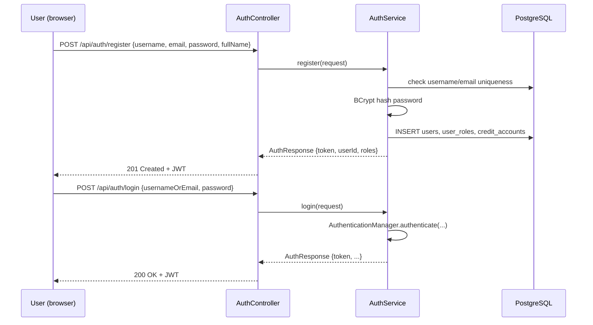
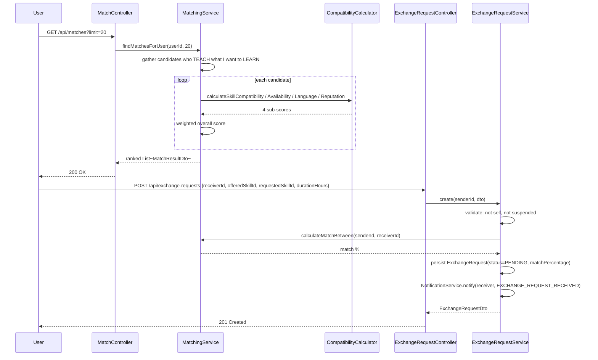
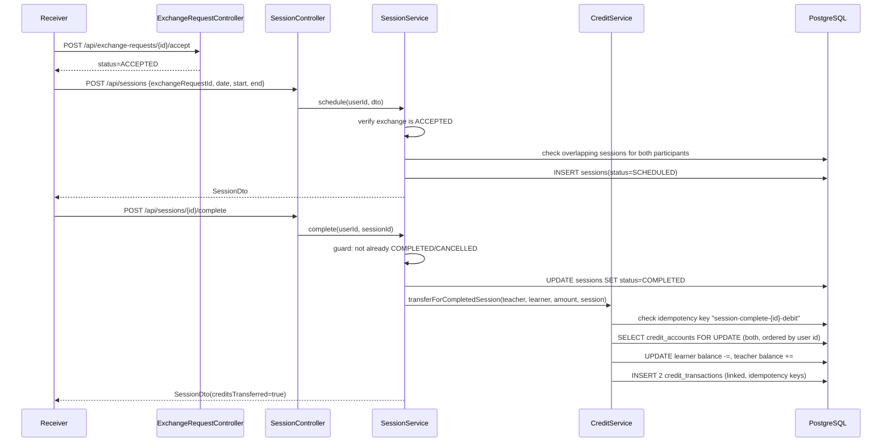
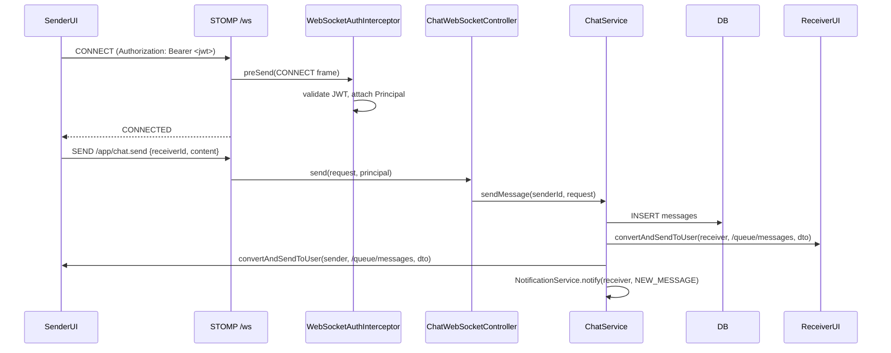

# Sequence Diagrams

## 1. Register → Login

```mermaid
sequenceDiagram
    participant U as User (browser)
    participant C as AuthController
    participant S as AuthService
    participant DB as PostgreSQL

    U->>C: POST /api/auth/register {username, email, password, fullName}
    C->>S: register(request)
    S->>DB: check username/email uniqueness
    S->>S: BCrypt hash password
    S->>DB: INSERT users, user_roles, credit_accounts
    S-->>C: AuthResponse {token, userId, roles}
    C-->>U: 201 Created + JWT

    U->>C: POST /api/auth/login {usernameOrEmail, password}
    C->>S: login(request)
    S->>S: AuthenticationManager.authenticate(...)
    S-->>C: AuthResponse {token, ...}
    C-->>U: 200 OK + JWT
```

## 2. Find Matches → Send Exchange Request

```mermaid
sequenceDiagram
    participant U as User
    participant MC as MatchController
    participant MS as MatchingService
    participant CC as CompatibilityCalculator
    participant EC as ExchangeRequestController
    participant ES as ExchangeRequestService

    U->>MC: GET /api/matches?limit=20
    MC->>MS: findMatchesForUser(userId, 20)
    MS->>MS: gather candidates who TEACH what I want to LEARN
    loop each candidate
        MS->>CC: calculateSkillCompatibility / Availability / Language / Reputation
        CC-->>MS: 4 sub-scores
        MS->>MS: weighted overall score
    end
    MS-->>MC: ranked List~MatchResultDto~
    MC-->>U: 200 OK

    U->>EC: POST /api/exchange-requests {receiverId, offeredSkillId, requestedSkillId, durationHours}
    EC->>ES: create(senderId, dto)
    ES->>ES: validate: not self, not suspended
    ES->>MS: calculateMatchBetween(senderId, receiverId)
    MS-->>ES: match %
    ES->>ES: persist ExchangeRequest(status=PENDING, matchPercentage)
    ES->>ES: NotificationService.notify(receiver, EXCHANGE_REQUEST_RECEIVED)
    ES-->>EC: ExchangeRequestDto
    EC-->>U: 201 Created
```

## 3. Accept Request → Schedule Session → Complete → Credits Transfer

```mermaid
sequenceDiagram
    participant Receiver
    participant EC as ExchangeRequestController
    participant SC as SessionController
    participant SS as SessionService
    participant CS as CreditService
    participant DB as PostgreSQL

    Receiver->>EC: POST /api/exchange-requests/{id}/accept
    EC-->>Receiver: status=ACCEPTED

    Receiver->>SC: POST /api/sessions {exchangeRequestId, date, start, end}
    SC->>SS: schedule(userId, dto)
    SS->>SS: verify exchange is ACCEPTED
    SS->>DB: check overlapping sessions for both participants
    SS->>DB: INSERT sessions(status=SCHEDULED)
    SS-->>Receiver: SessionDto

    Receiver->>SC: POST /api/sessions/{id}/complete
    SC->>SS: complete(userId, sessionId)
    SS->>SS: guard: not already COMPLETED/CANCELLED
    SS->>DB: UPDATE sessions SET status=COMPLETED
    SS->>CS: transferForCompletedSession(teacher, learner, amount, session)
    CS->>DB: check idempotency key "session-complete-{id}-debit"
    CS->>DB: SELECT credit_accounts FOR UPDATE (both, ordered by user id)
    CS->>DB: UPDATE learner balance -=, teacher balance +=
    CS->>DB: INSERT 2 credit_transactions (linked, idempotency keys)
    SS-->>Receiver: SessionDto(creditsTransferred=true)
```

## 4. Real-Time Chat Message

```mermaid
sequenceDiagram
    participant SenderUI
    participant WS as STOMP /ws
    participant Interceptor as WebSocketAuthInterceptor
    participant CWC as ChatWebSocketController
    participant Chat as ChatService
    participant DB
    participant ReceiverUI

    SenderUI->>WS: CONNECT (Authorization: Bearer <jwt>)
    WS->>Interceptor: preSend(CONNECT frame)
    Interceptor->>Interceptor: validate JWT, attach Principal
    WS-->>SenderUI: CONNECTED

    SenderUI->>WS: SEND /app/chat.send {receiverId, content}
    WS->>CWC: send(request, principal)
    CWC->>Chat: sendMessage(senderId, request)
    Chat->>DB: INSERT messages
    Chat->>ReceiverUI: convertAndSendToUser(receiver, /queue/messages, dto)
    Chat->>SenderUI: convertAndSendToUser(sender, /queue/messages, dto)
    Chat->>Chat: NotificationService.notify(receiver, NEW_MESSAGE)
```
